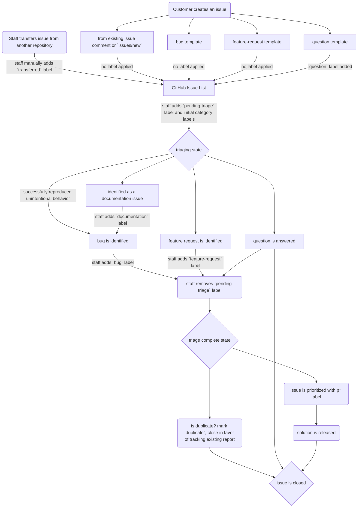

# GitHub Issue Triage Flowchart

In the flowchart below, GitHub issues will be triaged into one of three issue types:

- `bug`
- `feature-request`
- `question`

```mermaid
graph TD
    A(Staff transfers issue from another repository) -->|staff manually adds `transferred` label| H[GitHub Issue List]
    B(Customer creates an issue)
    B --> D[from existing issue comment or `issues/new`]
    B --> E[bug template]
    B --> F[feature-request template]
    B --> G[question template]
    H[GitHub Issue List]
    D -->|no label applied| H
    E -->|no label applied| H
    F -->|no label applied| H
    G -->|`question` label added| H
    I{triaging state}
    H -->|staff adds `pending-triage` label and initial category labels| I
    I -->|successfully reproduced unintentional behavior| J[bug is identified]
    I --> K[feature request is identified]
    I --> L[question is answered]
    I --> M[identified as a documentation issue]
    M -->|staff adds `documentation` label| J
    N(staff removes `pending-triage` label)
    J -->|staff adds `bug` label| N
    K -->|staff adds `feature-request` label| N
    L --> N
    O{triage complete state}
    N --> O
    P(issue is prioritized with p* label)
    Q(is duplicate? mark `duplicate`, close in favor of tracking existing report)
    O --> P
    O --> Q
    R(solution is released)
    P --> R
    Z{issue is closed}
    Q --> Z
    L --> Z
    R --> Z
```
