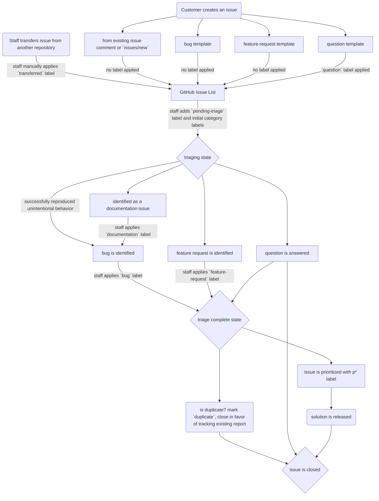

# GitHub Issue Triage Flowchart

```mermaid
graph TD
    A(Staff transfers issue from another repository) -->|staff manually applies `transferred` label| H[GitHub Issue List]
    B(Customer creates an issue)
    B --> D[from existing issue comment or `issues/new`]
    B --> E[bug template]
    B --> F[feature-request template]
    B --> G[question template]
    H[GitHub Issue List]
    D -->|no label applied| H
    E -->|no label applied| H
    F -->|no label applied| H
    G -->|`question` label applied| H
    I{triaging state}
    H -->|staff adds `pending-triage` label and initial category labels| I
    I -->|successfully reproduced unintentional behavior| J[bug is identified]
    I --> K[feature request is identified]
    I --> L[question is answered]
    I --> M[identified as a documentation issue]
    M -->|staff applies `documentation` label| J
    O{triage complete state}
    J -->|staff applies `bug` label| O
    K -->|staff applies `feature-request` label| O
    L --> O
    P(issue is prioritized with p* label)
    Q(is duplicate? mark `duplicate`, close in favor of tracking existing report)
    O --> P
    O --> Q
    R(solution is released)
    P --> R
    Z{issue is closed}
    Q --> Z
    L --> Z
    R --> Z
```
